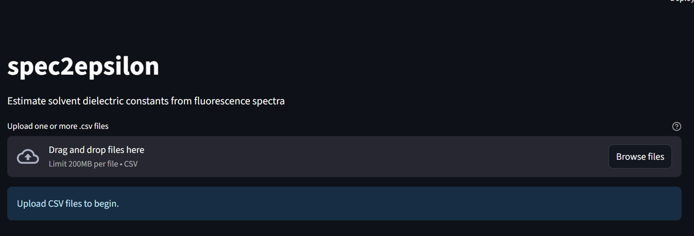
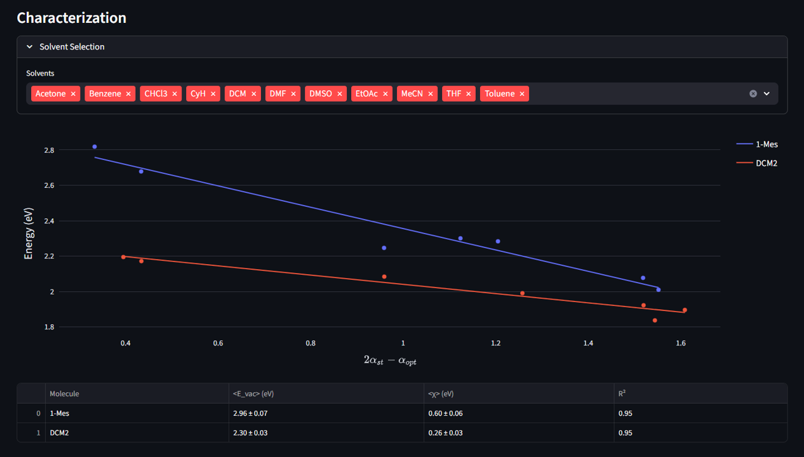
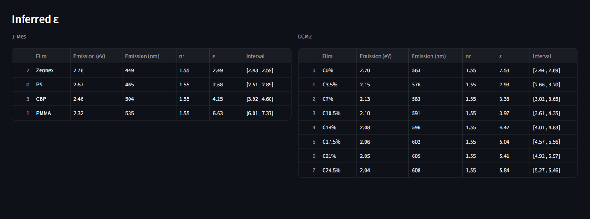

# spec2epsilon - Estimate dielectric constants from fluorescence spectra


[](https://www.python.org/)
[]()
[]()


## Cite as

[Bueno, Fernando Teixeira, Pedro Henrique de Oliveira Neto, and Leonardo Evaristo de Sousa. "Determining Static Dielectric Constants from Fluorescence Spectra." The Journal of Physical Chemistry Letters (2026).](https://doi.org/10.1021/acs.jpclett.5c03806)

## How to install it?

`pip install spec2epsilon`

## How to use it?

Once installed, use the command:

`spec2epsilon`

The application will open in your browser.





## Input files

The application requires a .csv file in the format shown below:

```csv
Solvent,epsilon,nr,Molecule_name
CyH,2.0165,1.4262,440
Tol,2.3800,1.4969,463
Diox,2.2099,1.4224,485
EtOAc,6.2530,1.3724,539
THF,7.5800,1.4072,543
CHCl3,4.8100,1.4458,552
Ace,20.700,1.3586,597
DMF,37.219,1.4305,617
PS,,1.5500,465
PMMA,,1.5500,535
Zeonex,,1.5500,449
CBP,,1.5500,504
```

The **solvent** column identifies the solvents and materials where fluorescence has been measured.

The **epsilon** column contains the static dielectric constant for known solvents. 
Rows that include **epsilon** values are used for the characterization of the molecule (calculation of $E_{vac}$ and $\chi$).  
Rows where **epsilon** is missing are interpreted as materials for which the inference procedure will be applied.  

The **nr** column contains the refractive index of each sample.

The **Molecule_name** column contains the peak of fluorescence spectra as measured in the different solvents/environments. Values may be provided in eV or nm. The column name should identify the molecule.
It is also possible to include more than one **Molecule_name** column in the same file, allowing characterization or inference for multiple molecules in parallel.

Examples of input files can be found in here [here](https://github.com/LeonardoESousa/spec2epsilon/tree/main/examples). These files can be uploaded to the application.


## Characterization and Inference



Once the csv files are uploaded, the application will fit the characterization data and show the computed values for the vacuum emission energy, the solvatochromic susceptibility and the $R^2$ of the fit. The list of selected solvents is shown on the top.


Further below, inferred $\epsilon$ values for data points with no declared $\epsilon$ are shown along with their uncertainty interval.  In the data tab, input data can be edited as well. 



## Tutorial

The csv file can be uploaded to the application. Alternatively, one may use the api. A tutorial is provided [here](https://github.com/LeonardoESousa/spec2epsilon/tree/main/examples/tutorial.ipynb).